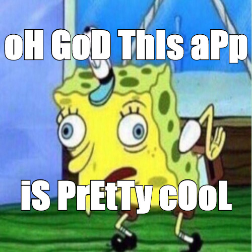

<!-- PROJECT SHIELDS -->
[![Contributors][contributors-shield]][contributors-url]
[![Forks][forks-shield]][forks-url]
[![Stargazers][stars-shield]][stars-url]
[![Issues][issues-shield]][issues-url]
[![MIT License][license-shield]][license-url]
[![LinkedIn][linkedin-shield]][linkedin-url]

<!-- PROJECT LOGO -->
 

  

<h3 align="center">SpongeMe</h3>

  

    Simple meme generator that allows users to create their own Mocking SpongeBob meme. The idea was given to me by a friend after I had finished my second semester in second year. Thanks Spencer
     
    <a href="https://github.com/RobMadill/SpongeMe-Website"><strong>Explore the docs »</strong></a>
     
     
    <a href="https://github.com/RobMadill/SpongeMe-Website">View Demo</a>
    ·
    <a href="https://github.com/RobMadill/SpongeMe-Website/issues">Report Bug</a>
    ·
    <a href="https://github.com/RobMadill/SpongeMe-Website/issues">Request Feature</a>
  

<!-- TABLE OF CONTENTS -->

  
Table of Contents

  <ol>
    <li>
      <a href="#about-the-project">About The Project</a>
      <ul>
        <li><a href="#built-with">Built With</a></li>
      </ul>
    </li>
    <li><a href="#contributing">Contributing</a></li>
    <li><a href="#license">License</a></li>
    <li><a href="#contact">Contact</a></li>
    <li><a href="#acknowledgments">Acknowledgments</a></li>
  </ol>

<!-- ABOUT THE PROJECT -->
## About The Project

(<a href="#top">back to top</a>)

### Built With

* [JavaScript](https://www.javascript.com/)

(<a href="#top">back to top</a>)

<!-- USAGE EXAMPLES -->
## Usage

This Website is simple and easy to use! First enter the text you'd like on top and then at the bottom. 
Once finished click SPONGE-IFY and you'll be prompted to download the image as a .jpg

(<a href="#top">back to top</a>)

<!-- CONTRIBUTING -->
## Contributing

If you have a suggestion that would make this better, please fork the repo and create a pull request. You can also simply open an issue with the tag "enhancement".
Don't forget to give the project a star! Thanks again!

1. Fork the Project
2. Create your Feature Branch (`git checkout -b feature/AmazingFeature`)
3. Commit your Changes (`git commit -m 'Add some AmazingFeature'`)
4. Push to the Branch (`git push origin feature/AmazingFeature`)
5. Open a Pull Request

(<a href="#top">back to top</a>)

<!-- LICENSE -->
## License

Distributed under the GNU General Public License. See `LICENSE` for more information.

(<a href="#top">back to top</a>)

<!-- CONTACT -->
## Contact

Rob Madill - [@linkedin](https://www.linkedin.com/in/robert-madill/) - robertmadill17@gmail.com

Project Link: [https://github.com/RobMadill/SpongeMe-Website](https://github.com/RobMadill/SpongeMe-Website)

(<a href="#top">back to top</a>)

<!-- ACKNOWLEDGMENTS -->
## Acknowledgments

* [Othneil Drew - README template](https://github.com/othneildrew/Best-README-Template)

(<a href="#top">back to top</a>)

<!-- MARKDOWN LINKS & IMAGES -->
[contributors-shield]: https://img.shields.io/github/contributors/RobMadill/SpongeMe-Website.svg?style=for-the-badge
[contributors-url]: https://github.com/RobMadill/SpongeMe-Website/graphs/contributors
[forks-shield]: https://img.shields.io/github/forks/RobMadill/SpongeMe-Website.svg?style=for-the-badge
[forks-url]: https://github.com/RobMadill/SpongeMe-Website/network/members
[stars-shield]: https://img.shields.io/github/stars/RobMadill/SpongeMe-Website.svg?style=for-the-badge
[stars-url]: https://github.com/RobMadill/SpongeMe-Website/stargazers
[issues-shield]: https://img.shields.io/github/issues/RobMadill/SpongeMe-Website.svg?style=for-the-badge
[issues-url]: https://github.com/RobMadill/SpongeMe-Website/issues
[license-shield]: https://img.shields.io/github/license/RobMadill/SpongeMe-Website.svg?style=for-the-badge
[license-url]: https://github.com/RobMadill/SpongeMe-Website/blob/master/LICENSE
[linkedin-shield]: https://img.shields.io/badge/-LinkedIn-black.svg?style=for-the-badge&logo=linkedin&colorB=555
[linkedin-url]: https://www.linkedin.com/in/robert-madill/
